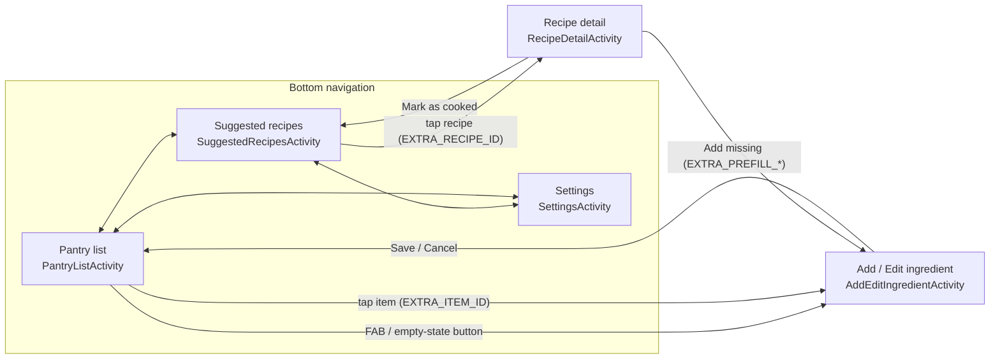
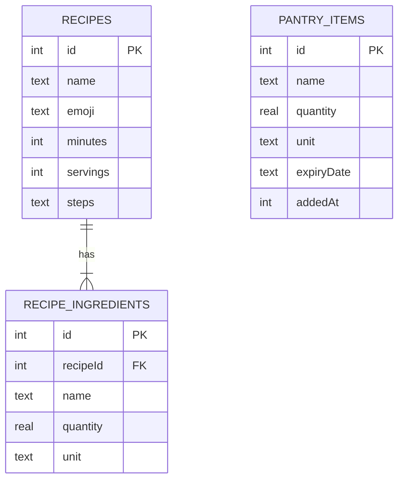

# System design (for the report)

## Screen flow



## Data model (ER diagram)


`PANTRY_ITEMS` and `RECIPE_INGREDIENTS` are related **by meaning, not by a key**: the matching engine links them by
comparing normalised ingredient names (`IngredientNormalizer`), which is what makes “Tomatoes” match “tomato”.

## Strict-matching algorithm (pseudo-code)

```
for each recipe:
    for each required ingredient r:
        key   = normalise(r.name)
        have  = sum of all usable pantry entries with normalise(name) == key, converted to r's unit family
        need  = r.quantity converted to base units
        if have < need:  mark r as NOT covered
    if no ingredient is NOT covered:   -> "Ready to cook"   (strict list)
    else if exactly one is NOT covered -> "Almost there"    (optional, separate list)
    else                               -> not shown
```
